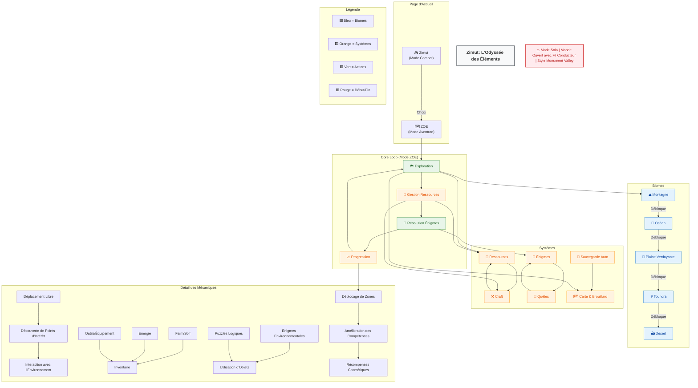

# ZOE - Schéma des Mécaniques de Jeu

## 📊 Diagramme Mermaid

---

## 📌 Légende
- **🟦 Bleu** : Biomes (environnements du jeu)
- **🟨 Orange** : Systèmes (ressources, craft, quêtes, etc.)
- **🟩 Vert** : Actions (exploration, résolution d'énigmes)
- **🟥 Rouge** : Points de départ/fin

## 🔗 Liens Utiles
- [Game Design Document (GDD)](./GDD.md)
- [Dépôt Zimut](../../../)
